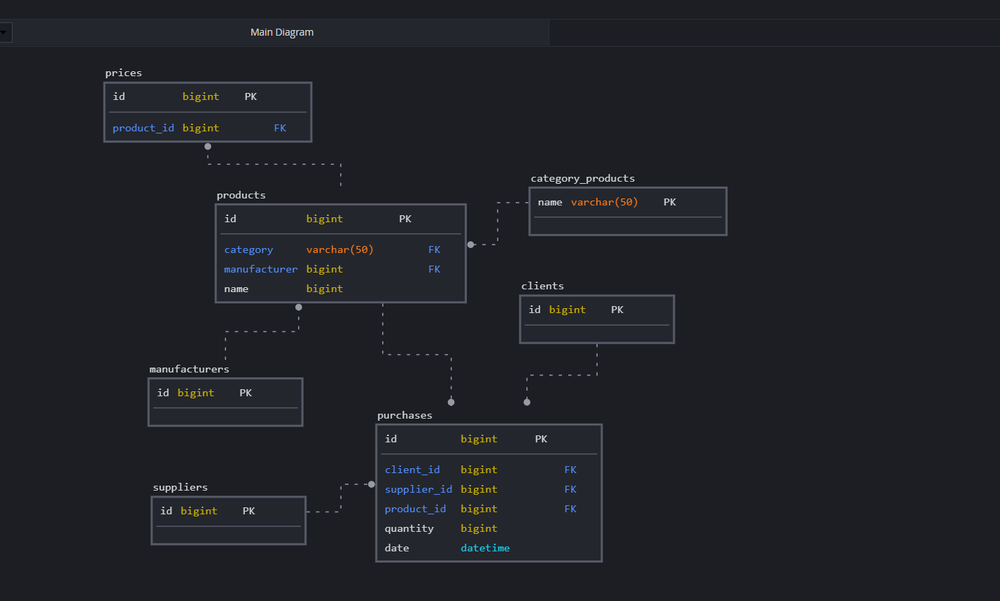

## Проектирование схемы БД для интернет-магазина

Необходимо реализовать сущности: 
1. продукты (products) 
2. категории продуктов (category_products)
3. цены (prices)
4. поставщики (suppliers)
5. производители (manufactures)
6. покупатели (clients)
7. покупки (purchases) 

Схема базы:

