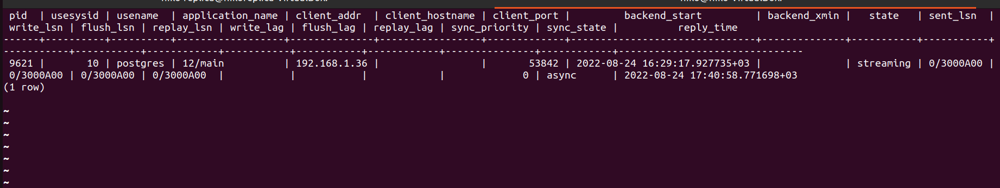
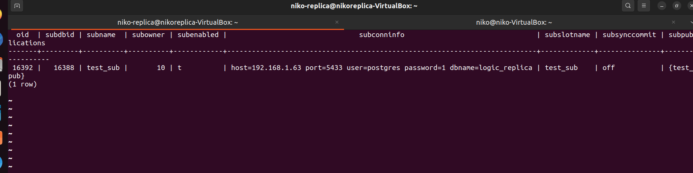

## Репликация 

#### Физическая репликация

На мастере запускаем слот репликации 
```sql
select pg_create_physical_replication_slot
```
в файле postgresql.conf проставляем параметр 
wal_receiver_status_interval = 600s(отставание реплики от мастера на 5 минут)
 


#### Логическая репликация

Создаем новый кластер и подключаемся к нему
sudo pg_createcluster 12 logic-replica
sudo -u postgres -i 
psql -p 5433

Создаем БД для логической репликации
```sql
create database logic_replica
```

Создаем таблицу тест
```sql
create table test(test_number int);
```

Заполняем данными таблицу тест
```sql
insert into test(test_number) values (1);
insert into test(test_number) values (2);
insert into test(test_number) values (3);
insert into test(test_number) values (4);
insert into test(test_number) values (5);
```

Создаем публикацию на мастере
```sql
create publication test_pub for table test;
```

Создаем подписчика на реплике 
```sql
create subscription test_sub connection 'host=192.168.1.63 port=5433 user postgres password=1' ||
    'dbname=logic_replica' publication test_pub;
```

