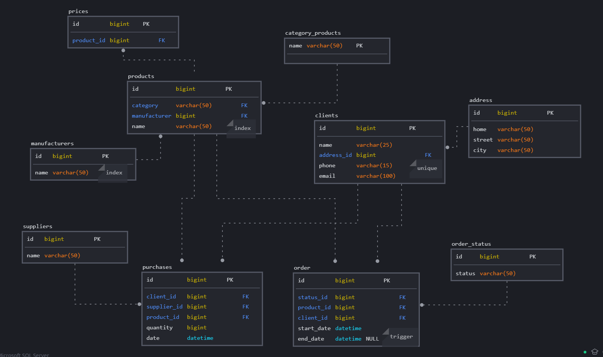

## Добавление в модель дополнительных индексов и ограниченичений

В работе применил индексы для поля name в таблицах products и manufactures, 
т.к. предполагается что запросов чтения будет гораздо больше, 
а записи осуществляться - лишь изредка. 

В таблице clients поля phone и email - будут уникальными 

В таблице order поле end_date - может быть нулевым и 
проставляется в конце выполнения заказа, когда 
в таблице order_status поле status = "SUCCESS"  

Схема базы:

