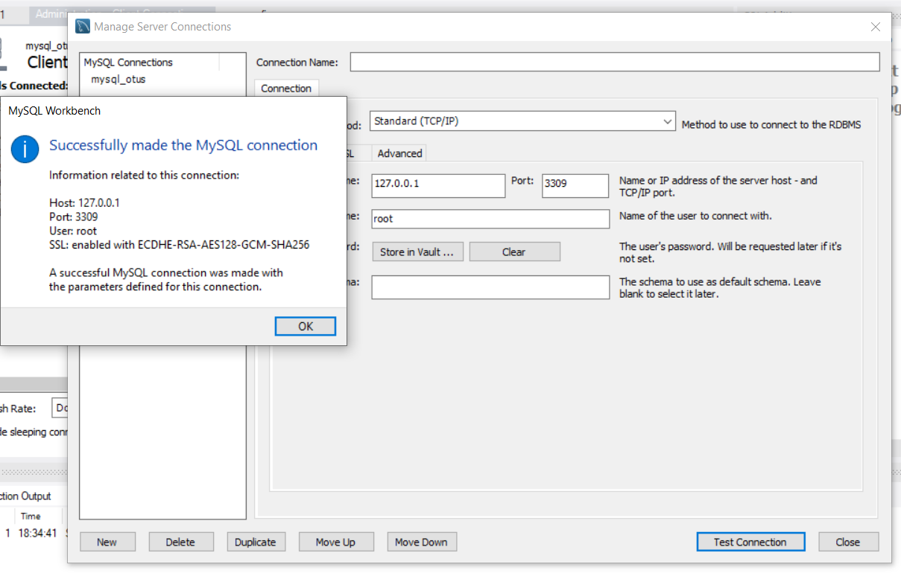

## Внутренняя архитектура СУБД MySQL 

[файл настройки](/resources/custom.conf/my.cnf)
innodb_flush_method=O_DIRECT - препятсвует дополнительному кешированию данных со стороны ОС Линукса
innodb_buffer_pool_size=4294967296 - выбираем подходящий размер оперативной памяти отведенной под буфер
secure_file_priv = "" - разрешает импорт / экспорт файлов 
 
[docker-compose](/resources/docker-compose.yml)

[init-sql](/resources/init.sql)

Поднять сервис db_va можно командой:

`docker-compose up otusdb`

Для подключения к БД используйте команду:

`docker-compose exec otusdb mysql -u root -p12345 otus`

Для использования в клиентских приложениях можно использовать команду:

`mysql -u root -p12345 --port=3309 --protocol=tcp otus`

