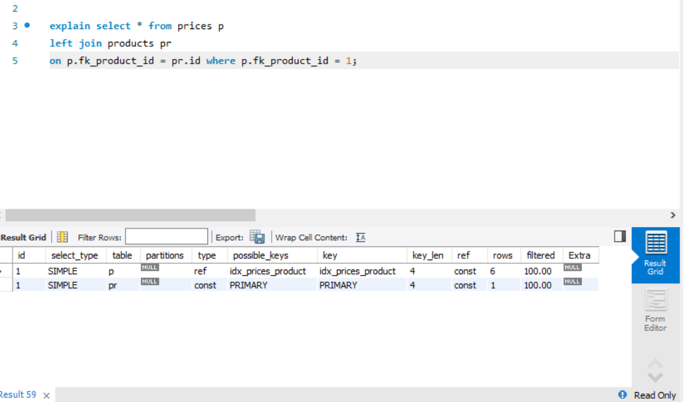
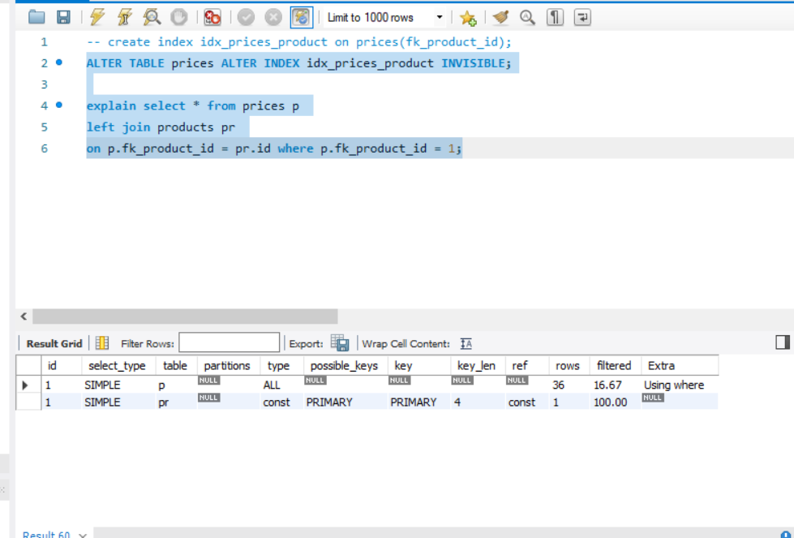
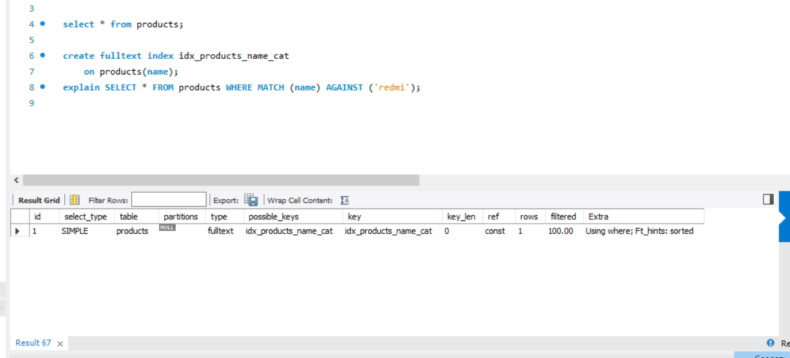

## Index в MySQL

```sql
create index idx_pricelist_products on pricelist_products(fk_product_id, fk_price_id, fk_pricelist_id);
```

```sql
create index idx_prices_product on prices(fk_product_id);
```
Explain с индексом


Explain без индекса


```sql
create fulltext index idx_products_name_cat 
    on products(name);
```

```sql
SELECT * FROM products WHERE MATCH (name) AGAINST ('redmi');
```

Explain с индексом
