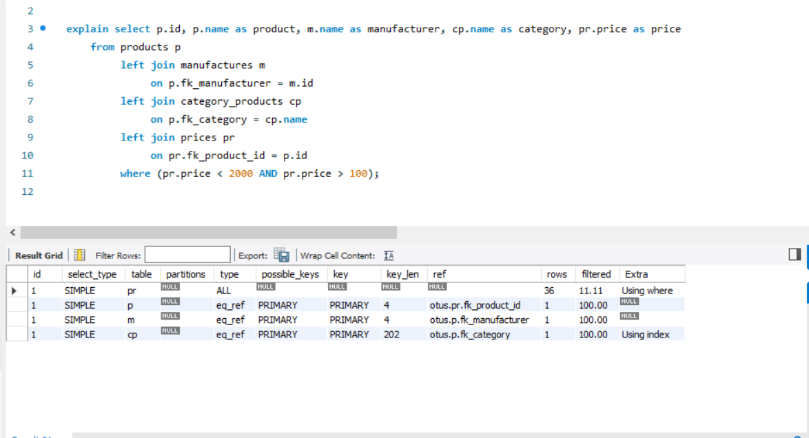
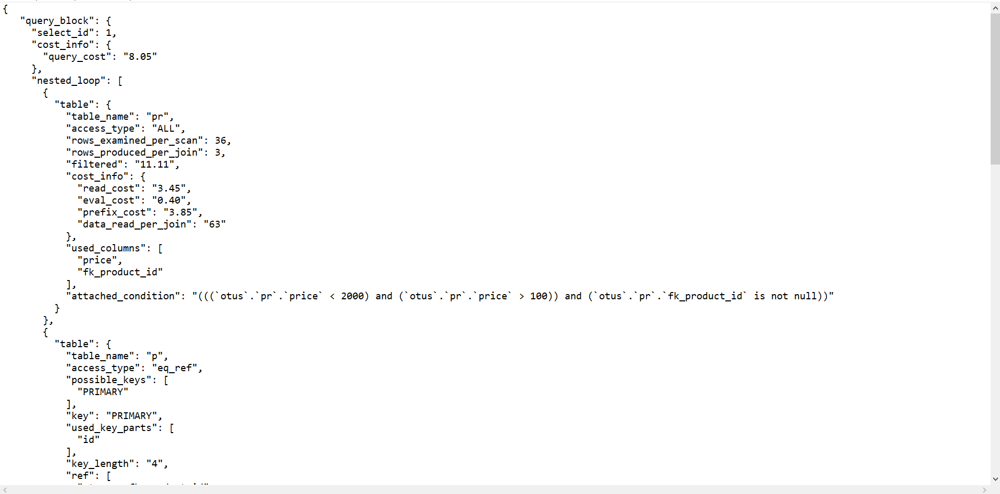
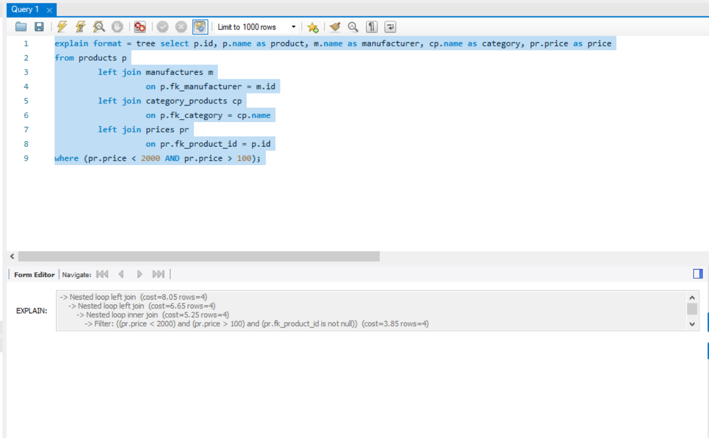
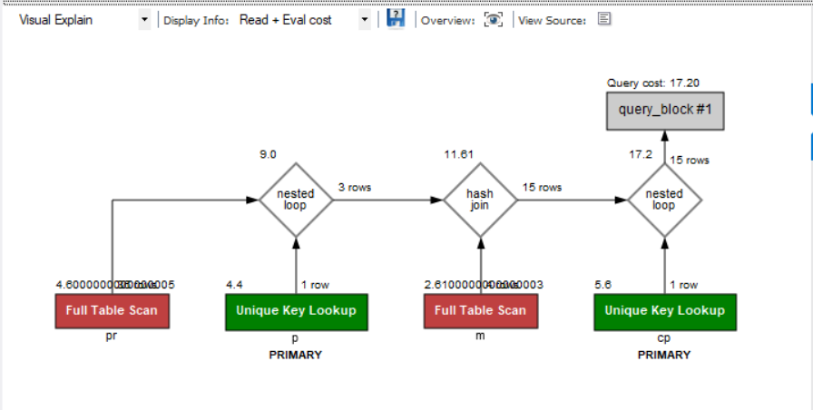
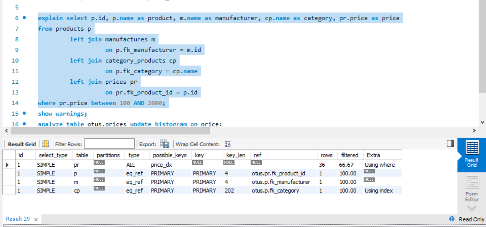
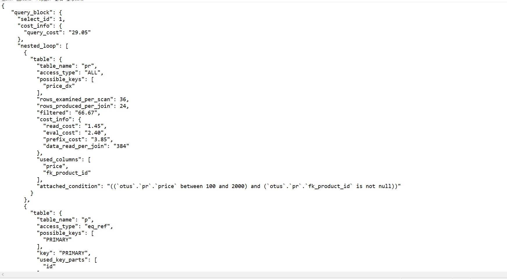
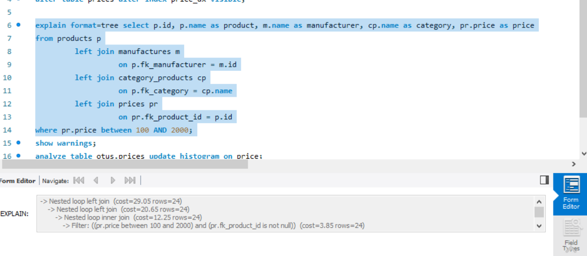
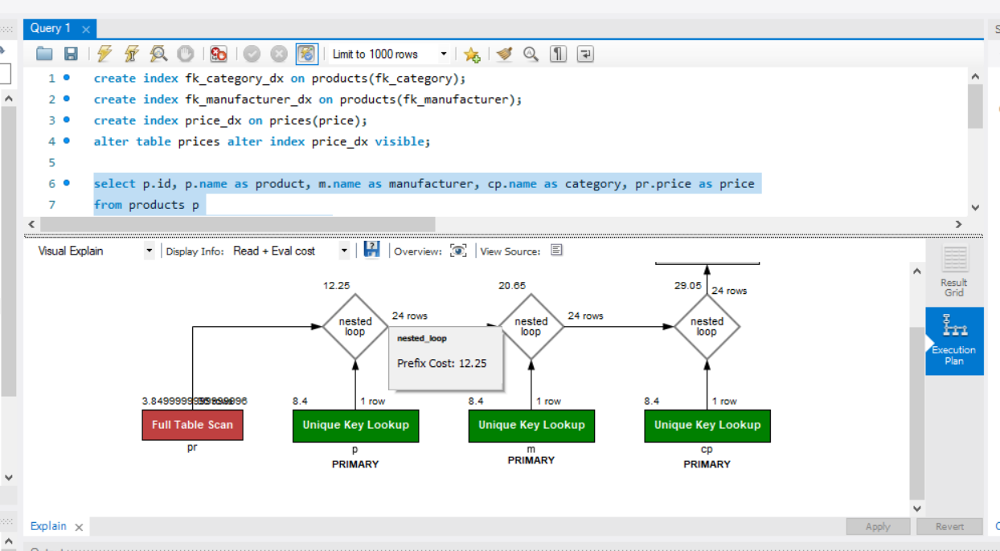

## Оптимизация производительности. Профилирование. Мониторинг


```sql
select p.id, p.name as product, m.name as manufacturer, cp.name as category, pr.price as price
from products p
         left join manufactures m
                   on p.fk_manufacturer = m.id
         left join category_products cp
                   on p.fk_category = cp.name
         left join prices pr
                   on pr.fk_product_id = p.id
where (pr.price < 2000 AND pr.price > 100); 
```

Explain запроса до оптимизации





#### Оптимизация запроса
`Выбираем только те колонки, котрые нам нужны` 

Перепишем запрос через between 
```sql
select p.id, p.name as product, m.name as manufacturer, cp.name as category, pr.price as price
from products p
         left join manufactures m
                   on p.fk_manufacturer = m.id
         left join category_products cp
                   on p.fk_category = cp.name
         left join prices pr
                   on pr.fk_product_id = p.id
where pr.price between 100 AND 1000; 
```

Поставим индекс на поля по которым делаем join

```sql
create index fk_category_dx on products(fk_category);
create index fk_manufacturer_dx on products(fk_manufacturer);
create index price_dx on prices(price);
```

Explain после оптимизации 




