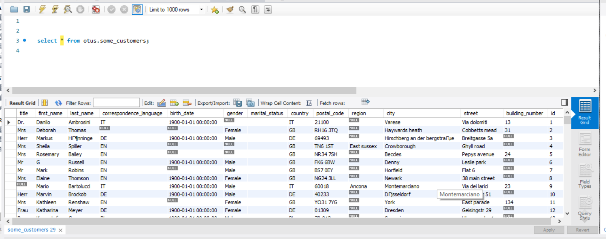

## Строим модель данных

Начальная модель данных

Конечная модель данных

   Предварительно обработал данные на замену пустых значений на null. 
   Сущности выделены по принципу уникальности. Так среди countries и correspodent_language встречаются 
очень много одинаковых значений. Также языков может быть несколько, поэтому решено было эти сущности 
выделить в отдельные таблицы. 
   Таблица gender - выделена в отдельную таблицу также на основании уникальности
значений и возможности расширения ее в дальнейшем, т.к. возможно в будущем придется учитывать больше двух
гендеров. 
   Добавлены две новых таблицы contact_information и communication_type. В первой перечислены все варианты
для связи с клиентом, а во второй предпочситаемый тип связи.
   Также адресс выделен в отдельную таблицу. Список городов не стал выносить в отдельную таблицу, потому 
что они зависят от а) страны и б) большинство клиентов представлены из разных городов, таким образом очень
много уникальных значений и нет смысла дробить таблицы дальше.   