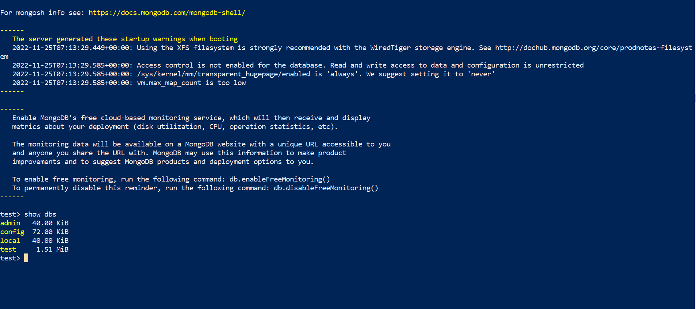
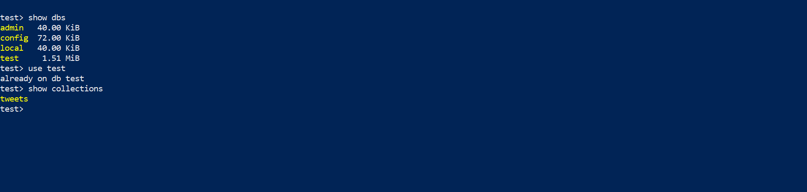

## MongoDB

Скачиваем нужным нам образ монго
`sudo docker pull mongo:6.0.3`

Указавыем директорию где Монго будет хранить свои файлы
`sudo docker run -it -v mongodata:/data/db --name mongodb -d mongo`

Заходим в баш инстанса
`docker exec -it mongodb bash`

Включаем shell монго
`mongosh`

Загружаем файлы с локальной машины в докер контейнер
`docker cp C:\Users\nnikolskiy\Downloads\tweets\dump\twitter\tweets.bson mongodb:/var/tweets`

Устанавливаем в контейнер инструменты для работы с монго(в частности mongostore для заполнения данных 
формата bson)
`apt install mongodb-database-tools`

Заливаем данные в монго
`mongorestore -d test /var/tweets/tweets.bson`

Таблицы в монго(видим нашу таблицу test)

Посмотрим коллеции

Создание новой коллекции
`db.createCollection("new_test")`

Добавление объекта в коллекцию
`db.new_test.insertOne({item: "card", qty: 15, name: "test"})`

Показывает первые 20 элементов коллекции
`db.tweets.find().pretty()`

Нахождение всех неретвитнутых элементов
`db.tweets.find({ retweeted: false})`